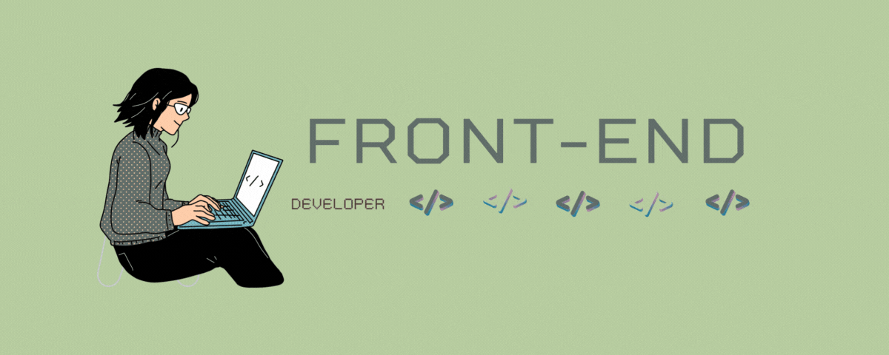

 
  

   Soy Fabiola, me encanta la programación y estoy comprometida con encontrar soluciones innovadoras a los problemas. Estudié en Laboratoria donde adquiri habilidades
   en programación y desarrollo web, y he participado en proyectos simulados para poner en práctica mis conocimientos.

- 👩‍💻 Actualmente soy una **Desarrolladora Frontend Junior** y estoy trabajanso en proyectos personales.
- 🌟 He utilizado metodologías ágiles como Scrum para facilitar la colaboración y maximizar la eficiencia del equipo.
- 🕹 ¡Soy una apasionada de la tecnología y los retos!

 

  
  <table><tr><td valign="top" width="33%">

  
 
 
 
 
 
 
 
 
 
 
 
 
 
 
      

    </td></tr></table>  

   

 
  
- Trabajo en equipo
- Resolución de problemas
- Empatía
- Creatividad
- Organización 
- Aprendizaje autonomo 
  
 

 
- Desarrolladora Front-End en proyectos simulados en Laboratoria: Desde que me uní a Laboratoria, he trabajado en varios proyectos simulados que me permitieron experimentar y poner en práctica mis conocimientos de programación y desarrollo web. Durante este tiempo, he aprendido a trabajar en equipo, a gestionar proyectos y a resolver problemas de manera efectiva.

 
1. **[Card Validation](https://kellyfabiolafc.github.io/DEV004-card-validation/)**: Proyecto creado con el objetivo de mejorar la experiencia del usuario al realizar tareas específicas, como validar un número de tarjeta de crédito. 
2. **[Studio Ghibli](https://kellyfabiolafc.github.io/DEV004-data-lovers/src/)**: Proyecto creado con la finalidad de proporcionar información detallada sobre las animaciones de Studio Ghibli. 
3. **[Wanderlust](https://wanderlust-kea.netlify.app/)**: Red social de viajes donde los usuarios pueden compartir sus aventuras y descubrir nuevos destinos a través de la experiencia de otros viajeros. 
  
 

  

 
 

 

 

  

  
  

¡Gracias por visitar mi repositorio de GitHub! Siéntete libre de explorar mis proyectos y contactarme si tienes alguna pregunta o comentario.
